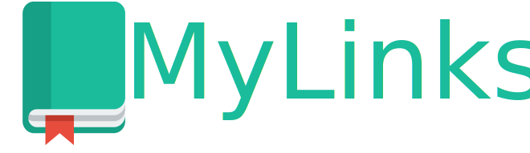

<h1 align="center">
    
</h1>

<h4 align="center">
   :books: O Produto possibilita armazenar os seus links favoritos e visualizá-los.
</h4>
 
<h4/>
<p align="center">
  
<p/>

<p align="center">
  
</p>


## :bulb: Instalação

Abaixe o projeto com 
```shell
git clone https://github.com/thelokys/mylinks-app.git # HTTPS
ou
git clone git@github.com:thelokys/mylinks-app.git # SSH
```
## :rocket: Executando projeto

Entre da pasta do projeto`cd mylinks-app/`

Utilize o [yarn](https://classic.yarnpkg.com/lang/en/) para iniciar o projeto. Dentro da pasta execute `yarn install` para baixar as dependências (Só existe o [Nodemon](https://github.com/remy/nodemon/)).

`$ yarn api` para subir na porta 3000 api.

`$ yarn start` para subir na porta 5000 o front.

> Para mais informações verifique o `package.json`

## :computer: Tecnologias
  
Tecnologia utilizada:
- [Node.js](https://nodejs.org/en/)

---
Masterclass realizado pela RocketSeat  [MasterClass](https://youtu.be/DiXbJL3iWVs)
