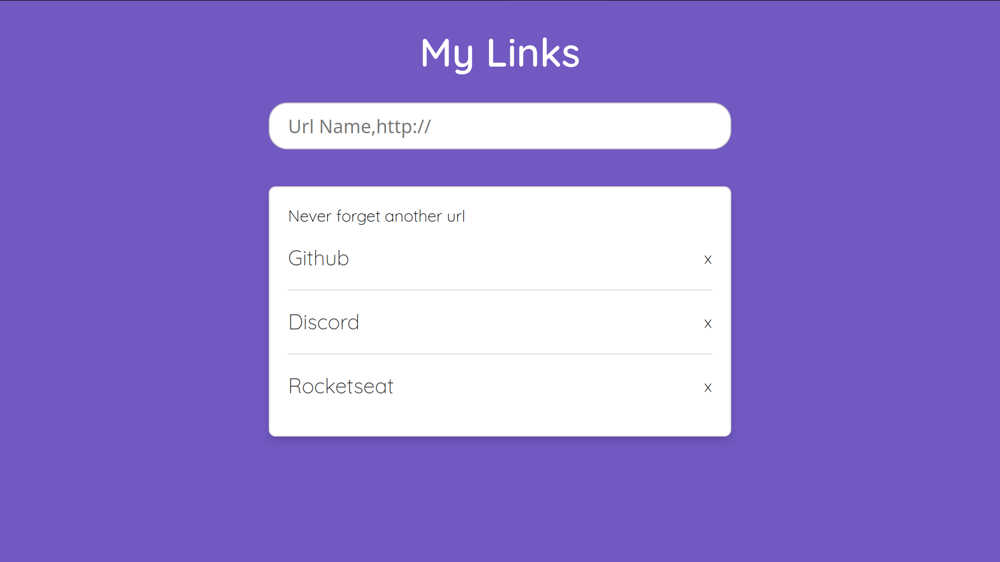

<h1 align="center">
    
</h1>

<h4 align="center">
   :rocket: O Produto possibilitar armazenar os seus links favoritos e visualizá-los. Conforme o seu cadastro.
</h4>
 
<h4/>

  

  

## :computer: Tecnologias
  
Tecnilogia utilizada:
- [Node.js](https://nodejs.org/en/)

---
Masterclass realizado pela RocketSeat  [MasterClass](https://youtu.be/DiXbJL3iWVs)
